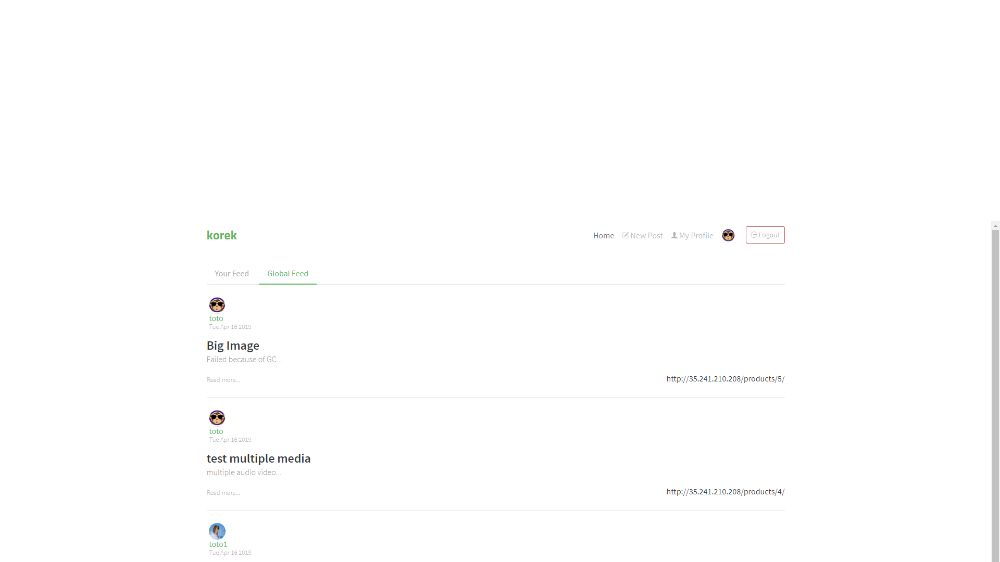

# 

This frontend is based on https://github.com/gothinkster/react-redux-realworld-example-app

> ### This frontend is a user content management system example for web applications

## Getting started

You can view a live demo over at (http://35.241.210.208:4100)

> user: toto password: toto
> user: toto1 password: toto

To get the frontend running locally:

- Clone this repo
- `npm install` to install all req'd dependencies
- `npm start` to start the local server (this project uses create-react-app)

Local web server will use port 4100. You can configure port in scripts section of `package.json`.
 
### Making requests to the backend API

The Django source code for the backend server can be found in the [KOREK github repository](https://github.com/MathieuB1/KOREK).

For convenience, we have a live API server running at http://35.241.210.208/ for the application to make requests against.

If you want to change the API URL to a local server, simply edit `src/agent.js` and change `API_ROOT` to the local server's URL (i.e. `http://localhost/`)

## Functionality overview

The example application is targeting the KOREK backend API, which provides a Django backend for managing users & media posts

**General functionality:**

- Authenticate users via JWT (login/signup pages + logout button on header)
- CRU* users (sign up & settings page & deleting user)
- CRUD Articles (Images & Videos & Audio creation support)
- GET and display paginated lists of articles & friends
- Follow other users
- Articles Tags 